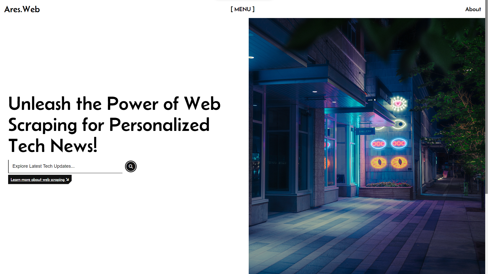

# Ares.Web

## Description

Ares.Web is a cutting-edge tech news website that aggregates news articles from various sources using web scraping technology. With a focus on providing a seamless user experience, Ares.Web aims to make it easy for tech enthusiasts to stay updated on their favorite technologies, all in one place.

## Technologies

Ares.Web utilizes a powerful combination of technologies to deliver a modern and interactive user interface:

- **HTML**: The backbone of web content, providing the structure and organization of the website.
- **CSS**: Enhances the visual presentation of the website, ensuring an aesthetically pleasing and engaging user interface.
- **JavaScript**: The programming language that brings interactivity and dynamic functionality to the website.
- **React**: A popular JavaScript library for building user interfaces, enabling smooth and efficient rendering of content.

## Key Features

1. **Web Scraping**: Ares.Web leverages web scraping techniques to gather the latest tech news articles related to the user's input. By accessing multiple sources, it ensures comprehensive coverage and a diverse range of perspectives.

2. **Tech News Aggregation**: With Ares.Web, tech enthusiasts no longer need to visit multiple websites or search through various platforms to find news about their favorite technologies. The platform centralizes all relevant information, providing a convenient one-stop solution.

3. **User-Friendly Interface**: Ares.Web prioritizes user experience, offering an intuitive and easy-to-navigate interface. Visitors can quickly access the latest articles, filter content by specific technologies or categories, and personalize their news preferences.

4. **Real-Time Updates**: Stay up-to-date with the rapidly evolving tech landscape. Ares.Web constantly updates its news feed, ensuring that users receive the most recent and relevant information in real-time.

5. **Customization Options**: Ares.Web enables users to personalize their reading experience. Users can create profiles, save favorite articles, and customize their news feed based on their specific interests and preferences.

6. **Responsive Design**: Ares.Web is designed to be fully responsive, adapting seamlessly to various devices and screen sizes. Whether accessed from a desktop computer, tablet, or mobile phone, users can enjoy a consistent and optimized experience.

Visit Ares.Web today and discover a hassle-free way to explore and stay informed about the latest advancements in technology.

*[HTML]: Hypertext Markup Language
*[CSS]: Cascading Style Sheets
*[JavaScript]: JavaScript
*[React]: React.js
